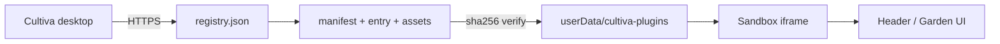

<div align="center">

# Cultiva Plugins

**Official sandboxed extension registry for [Cultiva](https://github.com/krwg/cultiva) — widgets, timers, and garden tools that stay on your device.**

[](registry.json)
[](LICENSE)
[-0071e3?style=flat-square&logo=electron&logoColor=white)](https://github.com/krwg/cultiva)
[](#catalog)
[](#security)
[](https://krwg.github.io/cultiva-plugins/)
[](#)

[Browse catalog (Pages)](https://krwg.github.io/cultiva-plugins/) · [Wiki](https://github.com/krwg/cultiva-plugins/wiki) · [Cultiva app](https://github.com/krwg/cultiva/releases) · [Author guide](https://github.com/krwg/cultiva/blob/main/docs/PLUGIN_AUTHOR_GUIDE.md) · [Plugin Hardening](https://github.com/krwg/cultiva-plugins/wiki/Plugin-Hardening)

</div>

---

This repository is the **single source of truth** for Cultiva desktop plugins. The app downloads `registry.json`, verifies **sha256 integrity** for every file, installs into a local sandbox, and runs extensions without Node.js or npm on the user side.

**No store account. No telemetry. No habit data leaves your machine.**

---

## Table of contents

- [Catalog](#catalog)
- [How it works](#how-it-works)
- [For Cultiva users](#for-cultiva-users)
- [Security](#security)
- [For plugin authors](#for-plugin-authors)
- [Repository layout](#repository-layout)
- [Publishing checklist](#publishing-checklist)
- [License](#license)

---

## Catalog

| Plugin | Min Cultiva | Surface | Description |
|--------|-------------|---------|-------------|
| [**Time**](time/) | 1.1.0 | Header | Live clock and time zones in a polished sheet |
| [**Radio**](radio/) | 1.1.0 | Header | SomaFM streams, sleep timer, glass UI |
| [**Pomodoro**](pomodoro/) | 1.1.0 | Header | Classic 25/5 focus timer in the header |
| [**Weather**](weather/) | 1.7.0 | Header + garden | Open-Meteo + 1100+ Russian cities offline search |
| [**Quote**](quote/) | 1.7.0 | Garden | 1000 EN/RU quotes, favorites, locale-pure banks |
| [**Habit Reflection**](habit-reflection/) | 1.7.0 | Hooks | One-line micro-journal after each completion |
| [**Weekly Stats**](weekly-stats/) | 2.0.0 | Garden + hooks | 7-day chart and weekly rate (Cultiva 2.0 analytics) |
| [**Routine**](routine/) | 2.0.0 | Garden + hooks | Morning/evening checklist matched by habit name |
| [**Gentle Nudge**](gentle-nudge/) | 2.0.0 | Hooks | Friendly in-app reminder after your chosen hour |

In the Cultiva app: **Получить** for plugins you have never installed before; **Установить** if you installed them previously on this device (tracked locally).

<details>
<summary><strong>Tags by plugin</strong></summary>

| Plugin | Tags |
|--------|------|
| Weather | `widget`, `weather`, `russia` |
| Time | `widget`, `clock`, `timezone` |
| Radio | `widget`, `radio`, `music`, `ambient` |
| Pomodoro | `widget`, `timer`, `focus`, `productivity` |
| Quote | `widget`, `garden`, `quote` |
| Streak | `habits`, `streak`, `notification` |

</details>

---

## How it works



1. Cultiva fetches [`registry.json`](registry.json) from this repo (`krwg/cultiva-plugins`).
2. User taps **Get** (first time on this device) or **Install** (if the plugin was installed before — tracked locally).
3. Electron downloads each file listed in the manifest (`entry`, `styles`, `data`).
4. **sha256** from the registry must match the downloaded bytes.
5. For first-time plugins, user taps **Install** after **Get** to activate the sandbox.
6. Plugin code runs in an **opaque-origin iframe** with declared permissions only.

Requires **Cultiva 1.1.0+** for header widgets; **1.7.0+** for garden/hooks; **2.0.0 Rowan** for habit analytics plugins (`minAppVersion` in registry).

---

## For Cultiva users

1. Install **[Cultiva](https://github.com/krwg/cultiva/releases)** (Windows, macOS, or Linux build).
2. Open **Settings → Plugins** and enable plugins if needed.
3. Under **Browse Plugins**, tap **Install** on any catalog entry.
4. Header widgets appear in the garden bar; garden widgets render in the home view.

| Tip | Detail |
|-----|--------|
| Desktop only | Install/uninstall requires the Electron app, not the browser preview |
| Offline habits | Habits and settings stay local; plugins may use network for their own data (e.g. weather API) |
| Disable all | Toggle **Enable Plugins** off — sandboxes stop, header chips removed |

---

## Security

| Mechanism | What it does |
|-----------|----------------|
| **sha256 registry map** | Every installable file has a hash in `registry.json`; mismatch aborts install |
| **HTTPS only** | Downloads restricted to GitHub raw / objects hosts |
| **Sandbox iframe** | No direct DOM or Node access from plugin code |
| **Permissions** | `network`, `storage`, `ui` declared in manifest and enforced at RPC |
| **Path guards** | Plugin ids and relative paths validated before write to disk |

Maintainers regenerate hashes after any file change:

```bash
node scripts/compute-registry-sha256.mjs
```

---

## For plugin authors

Full API reference: **[PLUGIN_AUTHOR_GUIDE.md](https://github.com/krwg/cultiva/blob/main/docs/PLUGIN_AUTHOR_GUIDE.md)** in the main Cultiva repo.

### Minimal plugin folder

```
my-plugin/
├── manifest.json    # id, version, permissions, entry, optional styles/data
├── index.js         # return new MyPlugin(context, hooks);
└── styles.css       # optional; injected into main window
```

### Registry entry

Each plugin needs a block in [`registry.json`](registry.json):

```json
{
  "id": "my-plugin",
  "name": "My Plugin",
  "version": "1.0.0",
  "author": "you",
  "description": "Short summary for Settings → Plugins.",
  "icon": "",
  "baseUrl": "https://raw.githubusercontent.com/krwg/cultiva-plugins/main/my-plugin",
  "minAppVersion": "1.7.0",
  "tags": ["widget"],
  "sha256": {
    "manifest.json": "...",
    "index.js": "..."
  }
}
```

### Bundled data (optional)

List static files under `manifest.data` — readable at runtime via `context.data.read('file.json')`. See **Weather** for a real example (`cities-ru.json`).

### Publish workflow

1. Fork this repo and add your plugin folder.
2. Run `node scripts/compute-registry-sha256.mjs` to fill `sha256` on your registry entry.
3. Open a PR with version bump and changelog note in the PR body.
4. After merge, Cultiva clients pick up the new catalog on next browse refresh.

---

## Repository layout

```
cultiva-plugins/
├── registry.json                      # catalog + sha256 (app reads this)
├── scripts/
│   └── compute-registry-sha256.mjs    # maintainer hash tool
├── weather/                           # header + garden, bundled cities JSON
├── time/                              # header clock
├── radio/                             # header streams
├── pomodoro/                          # header timer
├── quote/                             # garden widget
├── streak/                            # habit hook notifications
├── docs/index.html                    # GitHub Pages landing
└── LICENSE                            # MIT
```

---

## Publishing checklist

- [ ] `manifest.json` — valid id, semver, permissions, `minAppVersion` ≥ 1.7.0
- [ ] Entry script returns plugin instance; `onEnable` / `onDisable` if needed
- [ ] All files in `styles` / `data` listed and present on disk
- [ ] `node scripts/compute-registry-sha256.mjs` run; `registry.json` updated
- [ ] Tested install in Cultiva desktop (Settings → Plugins → Install)
- [ ] PR description lists permission rationale if `network` is used

---

## License

**MIT** — see [LICENSE](LICENSE).

Cultiva application is **[GPL-3.0](https://github.com/krwg/cultiva/blob/main/LICENSE)**; plugins in this registry are MIT so authors can reuse code freely.

**Contributing:** [CONTRIBUTING.md](CONTRIBUTING.md) · **Security:** [SECURITY.md](SECURITY.md) · **Code of Conduct:** [CODE_OF_CONDUCT.md](CODE_OF_CONDUCT.md) · **Changelog:** [CHANGELOG.md](CHANGELOG.md)

---

<div align="center">

Maintained by [krwg](https://github.com/krwg) · widgets for the garden, not the cloud

**[Cultiva](https://github.com/krwg/cultiva)** · **[Registry (Pages)](https://krwg.github.io/cultiva-plugins/)** · **[Issues](https://github.com/krwg/cultiva-plugins/issues)**

</div>
