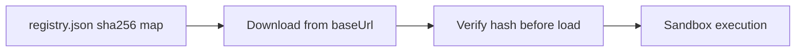

# Security

How the cultiva-plugins registry maintains integrity and what authors must respect.

---

## Integrity chain

Cultiva **refuses to load** plugin files whose hash does not match the registry entry.

---

## Author responsibilities

| Rule | Why |
|------|-----|
| No secrets in source | Plugin folders are public on GitHub |
| Declare `permissions` accurately | RPC calls are allowlist-gated |
| Minimize `network` usage | Only fetch trusted HTTPS endpoints |
| Escape user HTML in sheets | Prevent XSS in main window DOM |
| Bump version on every change | sha256 + catalog clarity |

---

## Sandbox boundaries

Plugins run in an opaque-origin iframe:
- No `window.electron`
- No direct Cultiva DOM access
- No Node.js APIs
- Storage is namespaced per plugin id

Main-window UI is injected by `plugin-manager` — treat all HTML as untrusted input on the host side too.

---

## data.read

Bundled files listed in `manifest.data` are read via Electron IPC in the desktop app only. Paths are restricted to the plugin install directory.

---

## Registry trust model

Default registry URL points to this repo (`krwg/cultiva-plugins`). Users can override the URL in advanced settings — **they trust whichever registry they configure**.

For third-party registries: same sha256 rules apply if using Cultiva 1.7+.

---

## Reporting vulnerabilities

- **Cultiva core:** [SECURITY.md](https://github.com/krwg/cultiva/blob/main/SECURITY.md) — private disclosure
- **Plugin in this registry:** open a **security** issue or email maintainer — do not exploit

---

## Known gaps (1.7)

- `postMessage` target origin `'*'` in sandbox bridge
- `Audio()` not permission-gated like `fetch`
- Failed plugin init may silently remove install entry (core UX issue)

Tracked under milestone **1.7 Linden · Plugin Hardening**.
